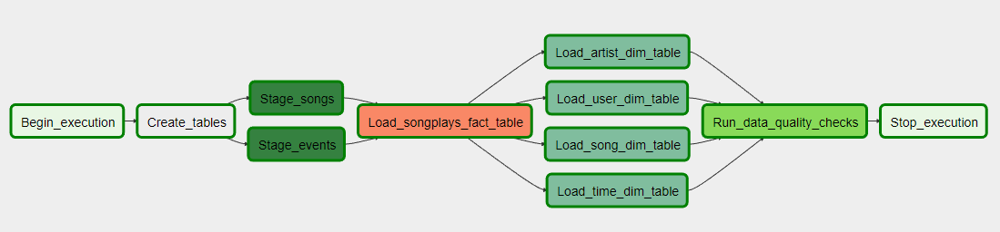
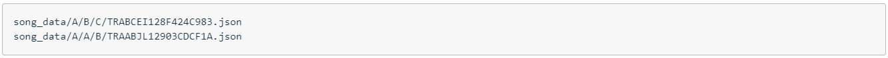
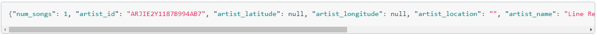
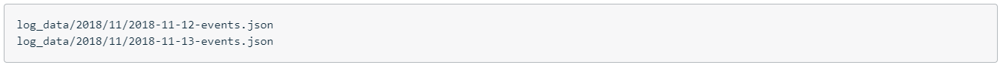
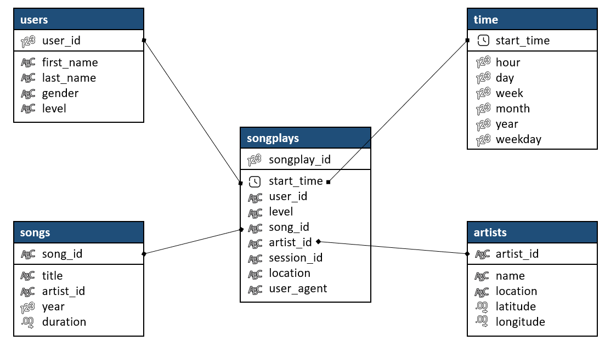

# Data Pipelines with Airflow
 ## **INTRODUCTION**
A music streaming company, Sparkify, has decided that it is time to introduce more automation and monitoring to their data warehouse ETL pipelines and come to the conclusion that the best tool to achieve this is Apache Airflow.

They have decided to bring me into the project and expect me to create high grade data pipelines that are dynamic and built from reusable tasks, can be monitored, and allow easy backfills. They have also noted that the data quality plays a big part when analyses are executed on top the data warehouse and want to run tests against their datasets after the ETL steps have been executed to catch any discrepancies in the datasets.

The source data resides in S3 and needs to be processed in Sparkify's data warehouse in Amazon Redshift. The source datasets consist of JSON logs that tell about user activity in the application and JSON metadata about the songs the users listen to.

---

## **APACHE AIRFLOW PIPELINE**

- **Begin_execution**: dummy operation to start the DAG.
- **Create_tables**: in this step, the staging tables and the table of the data warehouse are defined and created.
- **Stage_songs**: here the data are stored in the staging table "songs" before uploading them into their correspondent data darehouse table.
- **Stage_events**: here the data are stored in the staging table "events" before uploading them into their correspondent data darehouse table.
- **Load_songplays_fact_table**: in this operation, the data is upserted from the staging tables into the fact table "songplays".
- **Load_artist_dim_table**: in this operation, the data is upserted from the staging tables into the dimension table "aritst".
- **Load_user_dim_table**: in this operation, the data is upserted from the staging tables into the dimension table "user".
- **Load_song_dim_table**: in this operation, the data is upserted from the staging tables into the dimension table "song".
- **Load_time_dim_table**: in this operation, the data is upserted from the staging tables into the dimension table "time".
- **Run_data_quality_checks**: this operation checks that the upserting operations have been correctly executed.
---

## **INPUT DATA**

**Song dataset**: The first dataset is a subset of real data from the Million Song Dataset. Each file is in JSON format and contains metadata about a song and the artist of that song. The files are partitioned by the first three letters of each song's track ID. For example, here are filepaths to two files in this dataset.

And below is an example of what a single song file, TRAABJL12903CDCF1A.json, looks like.

**Log dataset**: The second dataset consists of log files in JSON format generated by this event simulator based on the songs in the dataset above. These simulate app activity logs from an imaginary music streaming app based on configuration settings.

The log files in the dataset you'll be working with are partitioned by year and month. For example, here are filepaths to two files in this dataset.

The project datasets can be accessed through the following links:
- **Song data**: *s3://udacity-dend/song_data*
- **Log data**: *s3://udacity-dend/log_data*

---

## **DATABASE SCHEMA**

---

## **FILES DESCRIPTION**
- **...** : ...

---

## **HOW TO RUN THE SCRIPTS?**

**AWS CREDENTIALS**

The AWS Access Key and the AWS Secret Access Key has to be entered in the configuration file (dl.cfg).

In case of using a notebook associated to an EMR Cluster, this file is not necessary.

**PYTHON FILE**

...

---
## **LICENSING, AUTHORS, ACKNOWLEDGEMENTS, ETC.**
- **Author**: The author of this analysis is Gonzalo Gomez-Millan
- **Acknowledgment**: Also noteworthy is the work of **Udacity** in promoting the performance of this analysis as one of the projects in order to pass the Data Engineering Nanodegree Program.